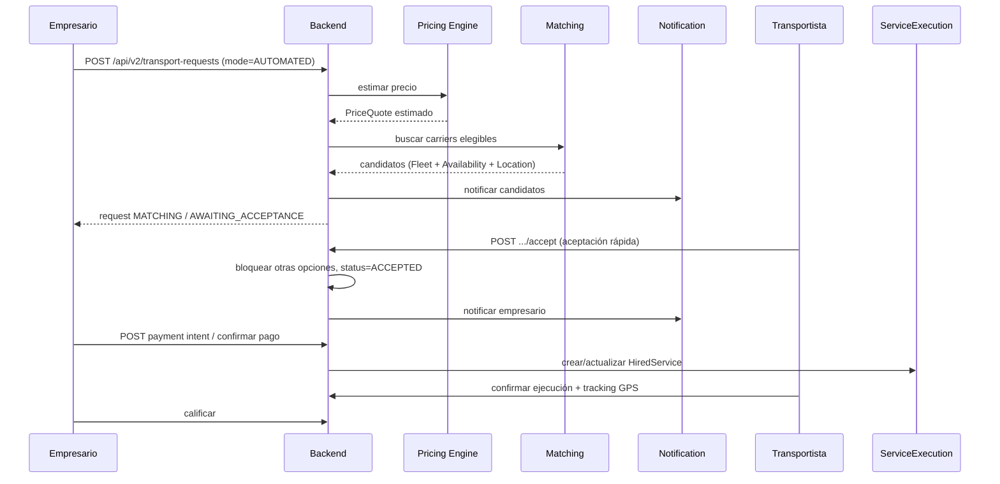

# PescaGo v2 — Plan de implementación backend

> **Rama de trabajo:** `feature/pescago-v2-backend-foundation`  
> **Fecha:** 2026-06-21  
> **Alcance:** diseño técnico previo a código. No modifica endpoints ni esquema existente.  
> **Fuentes:** `graphify-out/GRAPH_REPORT.md`, `graphify-out/graph.json`, código en `src/main/java/pe/upc/pescagobackend/`.

---

# 1. Estado actual confirmado

## 1.1 Stack y arquitectura

| Aspecto | Estado confirmado | Referencia |
|---------|-------------------|------------|
| Framework | Spring Boot **3.3.5**, Java **17** | `pom.xml` |
| Persistencia | PostgreSQL, Spring Data JPA | `application.properties`, `pom.xml` |
| Esquema | `spring.jpa.hibernate.ddl-auto=update` (sin Flyway/Liquibase) | `application.properties` |
| Seguridad | **Ausente** (`spring-boot-starter-security` no está en `pom.xml`) | `pom.xml` |
| API | REST JSON bajo `/api/v1` | Controladores en `*/interfaces/rest/` |
| Patrón | Monolito modular DDD/hexagonal por paquete | Comunidades Graphify (87) |

**Punto de entrada:** `PescagoBackendApplication.java`  
**Infraestructura compartida:** `shared/` — `AuditableAbstractAggregateRoot`, `CorsConfig`, `SnakeCasePhysicalNamingStrategy`.

## 1.2 Módulos actuales (bounded contexts de facto)

Graphify identifica 6 comunidades principales alineadas con controladores “god nodes” (`RequestController`, `HiredServiceController`, `CarrierController`, `UserController`):

| Módulo actual | Paquete | Entidad raíz | Tabla inferida |
|---------------|---------|--------------|----------------|
| **iam** | `iam/` | `User` | `users` |
| **carrier** | `carrier/` | `Carrier` | `carriers` |
| **entrepreneur** | `entrepreneur/` | `Entreprenuer` *(typo)* | `entreprenuers` |
| **request** | `request/` | `Request` | `requests` |
| **hiredService** | `hiredService/` | `HiredService` | `hired_services` |
| **receipt** | `receipt/` | `Receipt` | `receipts` |

**Value objects embebidos:** `Dimensions` (`request`), `CarrierData` (`hiredService` — `vehicleBrand`, `plate`, `driver`).

**Relaciones:** no hay `@ManyToOne`/`@OneToMany`. Solo IDs `Long` (`entrepreneurId`, `carrierId`, `userId`, `requestId`).

## 1.3 Endpoints actuales (26, todos públicos)

| Método | Ruta | Controlador |
|--------|------|-------------|
| POST | `/api/v1/users` | `UserController` |
| DELETE | `/api/v1/users/{userId}` | `UserController` |
| GET | `/api/v1/users/{userId}` | `UserController` |
| GET | `/api/v1/users/authentication` | `UserController` |
| POST | `/api/v1/carriers` | `CarrierController` |
| DELETE | `/api/v1/carriers/{id}` | `CarrierController` |
| GET | `/api/v1/carriers` | `CarrierController` |
| GET | `/api/v1/carriers/{id}` | `CarrierController` |
| POST | `/api/v1/entreprenuers` | `EntreprenuerController` |
| DELETE | `/api/v1/entreprenuers/{userId}` | `EntreprenuerController` |
| GET | `/api/v1/entreprenuers/{userId}` | `EntreprenuerController` |
| POST | `/api/v1/requests` | `RequestController` |
| GET | `/api/v1/requests/{id}` | `RequestController` |
| PUT | `/api/v1/requests/{id}` | `RequestController` |
| DELETE | `/api/v1/requests/{id}` | `RequestController` |
| GET | `/api/v1/requests/entrepreneur/{entrepreneurId}` | `RequestController` |
| GET | `/api/v1/requests/carrier/{carrierId}` | `RequestController` |
| POST | `/api/v1/hired-services` | `HiredServiceController` |
| GET | `/api/v1/hired-services/{id}` | `HiredServiceController` |
| PUT | `/api/v1/hired-services/{id}` | `HiredServiceController` |
| DELETE | `/api/v1/hired-services/{id}` | `HiredServiceController` |
| GET | `/api/v1/hired-services/entrepreneur/{entrepreneurId}` | `HiredServiceController` |
| GET | `/api/v1/hired-services/carrier/{carrierId}` | `HiredServiceController` |
| POST | `/api/v1/receipts` | `ReceiptController` |
| DELETE | `/api/v1/receipts/{receiptId}` | `ReceiptController` |
| GET | `/api/v1/receipts/{receiptId}` | `ReceiptController` |

## 1.4 Flujo de negocio implementado hoy

```
Registro (User + Carrier | Entreprenuer)
  → Login GET /users/authentication
  → Empresario: listar carriers → crear Request(s) por carrier seleccionado
  → Transportista: PUT /requests/{id} con precio (cotización manual)
  → Empresario: POST /receipts + PUT request Pagado + POST /hired-services
  → Transportista: PUT /hired-services/{id} con carrierData + Confirmado
```

**Estados usados en frontend (strings libres):** `Pendiente`, `Cotizado`, `Pagado`, `Confirmado` (español).  
**Defaults en entidades backend:** `PENDING` en `Request` y `HiredService` (`request/.../Request.java`, `hiredService/.../HiredService.java`).

## 1.5 Limitaciones que impiden matching automático directo

| Limitación | Impacto en v2 |
|------------|---------------|
| `Request` está **acoplada 1:1 a un `carrierId`** desde la creación | No hay solicitud “abierta” ni pool de candidatos |
| No existe **Fleet**, ubicación ni disponibilidad | Imposible filtrar transportistas elegibles por zona/capacidad |
| No hay **motor de precios** ni histórico | Solo `price` manual vía PUT |
| `status` es `String` sin enum ni máquina de estados | Transiciones no validadas; español/inglés mezclados |
| Sin **notificaciones** ni tokens push | No hay aviso de matching ni aceptación rápida |
| Sin **bloqueo optimista** ni `acceptedCarrierId` | No se puede “cerrar” otras opciones al aceptar |
| Sin autenticación ni roles enforced | Cualquier cliente puede mutar cualquier recurso |
| `CarrierRepository.findByUserId` existe pero **no hay endpoint** | Login móvil/web de carrier frágil (`GET /carriers/{id}` usa carrier id, no user id) |
| `ddl-auto=update` | Esquema no versionado; riesgo en despliegues |
| `CarrierData` solo en `HiredService` post-pago | Vehículo/conductor no modelados como flota reutilizable |

## 1.6 Monolito modular actual vs arquitectura objetivo del curso

| Objetivo del curso | Estado actual | Brecha |
|--------------------|---------------|--------|
| **Users** | `iam` + perfiles `carrier` / `entrepreneur` separados | Falta unificación de identidad, roles tipados, auth segura |
| **Fleet** | Solo `CarrierData` embebido en `HiredService` | Sin vehículos, conductores ni disponibilidad |
| **TransportRequest** | Módulo `request` | Sin modo automático, sin matching, sin cotización estimada |
| **ServiceExecution** | Módulo `hiredService` | Sin tracking, sin fases de ejecución tipadas |
| **Payment** | Módulo `receipt` (simulado) | Sin pasarela, CVV en BD, sin idempotencia |
| **Notification** | No existe | — |
| **Reputation** | No existe | — |

**Conclusión:** el monolito actual es un **MVP manual** con buena separación por paquetes DDD, pero los bounded contexts del curso requieren **nuevos módulos** y **ampliación** de `request`/`hiredService`, no un reemplazo abrupto.

---

# 2. Decisiones de arquitectura v2

## 2.1 Mapeo módulos actuales → bounded contexts objetivo

```
┌─────────────────────────────────────────────────────────────────┐
│                        MONOLITO PescaGo v2                       │
├─────────────┬─────────────┬──────────────────┬──────────────────┤
│   Users     │    Fleet    │ TransportRequest │ ServiceExecution │
│  (iam +     │  (nuevo)    │ (request ampl.)  │ (hiredService    │
│  profiles)  │             │                  │  ampl.)          │
├─────────────┴─────────────┴──────────────────┴──────────────────┤
│ Payment (receipt ampl.) │ Notification (nuevo) │ Reputation (nuevo)│
└─────────────────────────────────────────────────────────────────┘
```

| BC objetivo | Paquete v2 propuesto | Origen / estrategia |
|-------------|----------------------|---------------------|
| **Users** | `iam/` *(mantener)* + ampliación | `User`, roles enum; perfiles `carrier`/`entrepreneur` como agregados de perfil |
| **Fleet** | `fleet/` *(nuevo)* | Extraer y formalizar lo hoy en `CarrierData`; agregar vehículos y disponibilidad |
| **TransportRequest** | `request/` *(ampliar)* | Mantener `Request` para flujo manual; agregar `TransportRequestMode`, matching, quotes |
| **ServiceExecution** | `hiredService/` *(renombrar gradualmente a `serviceExecution/`)* | Ampliar estados, tracking, vínculo a fleet |
| **Payment** | `receipt/` + `payment/` *(nuevo facade)* | Mantener recibos legacy; nuevas intenciones de pago sin CVV |
| **Notification** | `notification/` *(nuevo)* | Push, in-app; desacoplado vía eventos de aplicación |
| **Reputation** | `reputation/` *(nuevo, soporte)* | Ratings post-servicio; lectura para matching futuro |

## 2.2 Compatibilidad temporal (no romper web Angular actual)

| Elemento | Decisión |
|----------|----------|
| Rutas `/api/v1/*` existentes | **Se mantienen** sin renombrar |
| Typo `/api/v1/entreprenuers` | **No cambiar** hasta migración coordinada con frontend |
| Clases `Entreprenuer`, `EntreprenuerController` | **No renombrar** en fase 0–2 |
| Estados en español en respuestas JSON | **Mantener** en endpoints legacy; nuevos endpoints pueden usar enum serializado |
| `POST /requests` con `carrierId` obligatorio | **Seguir soportando** (`mode=MANUAL` implícito) |
| `PUT /requests/{id}` para cotizar | **Seguir soportando** flujo manual |
| `CarrierData` en `HiredService` | **Mantener**; Fleet nuevo alimenta los mismos campos en transición |
| `GET /carriers` listado | **Mantener** para pantalla search-carriers |

## 2.3 Nombres con typo que NO deben cambiar aún

| Nombre | Ubicación | Consumidor |
|--------|-----------|------------|
| `entreprenuers` (ruta API) | `EntreprenuerController` | `ApiService.registerEntrepreneur`, `getEntrepreneurById` |
| `Entreprenuer` (clase entidad) | `entrepreneur/domain/...` | JPA tabla `entreprenuers` |
| `HIredServiceCommandServiceImpl` | `hiredService/application/...` | Interno; corregir solo cuando se toque el archivo |

## 2.4 Principios v2

1. **Strangler fig:** nuevas capacidades vía endpoints `/api/v2/` o sub-recursos; legacy intacto.
2. **IDs Long** como contrato entre módulos (eventos + ACL), JPA `@ManyToOne` solo donde justifique integridad fuerte (Fleet → Carrier).
3. **PostgreSQL + Flyway** desde Fase 0; transición controlada desde `ddl-auto=update` (ver §6.1).
4. **API contract-first** para web y futura app móvil (mismos DTOs, paginación, errores RFC 7807).
5. **Feature flag `request.mode`:** `MANUAL` | `AUTOMATED` en cada solicitud.

## 2.5 Compatibilidad real entre v1 y v2

| Aspecto | Decisión |
|---------|----------|
| **`/api/v1/*`** | Permanece **temporalmente sin JWT**, porque el Angular actual (`ApiService`) no envía `Authorization`. Todos los endpoints v1 siguen públicos en Fase 0. |
| **`/api/v2/*`** | Se protegen con **JWT desde el inicio** (`SecurityFilterChain` con matcher `/api/v2/**` autenticado). |
| **Protección de v1** | Fase **posterior**, coordinada con una **rama de frontend** que migre login y adjunte token (o consuma solo v2). No bloquear el MVP web actual. |
| **Login web carrier hoy** | `SignInComponent` llama `GET /api/v1/carriers/{user.id}` — usa **user id**, no carrier id (`CarrierQueryServiceImpl.findById`). |
| **`GET /api/v2/carriers/by-user/{userId}`** | **No corrige por sí solo** el login web; es auxiliar para admin/compatibilidad con validación de acceso (solo propio userId o ADMIN). |
| **Perfil de sesión v2** | Endpoint principal: **`GET /api/v2/users/me/profile`** — devuelve user + perfil de negocio (`carrier` o `entrepreneur`) según rol, derivado del JWT. |

### Tarea frontend futura (roadmap)

| Tarea | Repositorio | Descripción |
|-------|-------------|-------------|
| **FE-v2-auth** | `PescaGo-Frontend` | Migrar login a `POST /api/v2/auth/login`; guardar `accessToken`; usar `GET /api/v2/users/me/profile` en lugar de `getCarrierById(user.id)` / `getEntrepreneurById(user.id)`. |
| **FE-v2-http-interceptor** | `PescaGo-Frontend` | Interceptor que adjunta `Authorization: Bearer` en llamadas v2. |
| **FE-v1-sunset** | Ambos | Tras migración completa, coordinar cierre público de v1. |

## 2.6 Transición de roles (datos existentes)

**Valores actuales en BD** (`User.role`, `String`): `carrier`, `entrepreneur`, default `"USER"` en constructor (`iam/.../User.java`).

| Regla | Detalle |
|-------|---------|
| **No cambiar bruscamente** la columna a `@Enumerated` ni migrar valores en Fase 0 sin script explícito. |
| **Persistencia** | Mantener `VARCHAR` en `users.role`. |
| **Dominio v2** | Enum canónico interno `Role { CARRIER, ENTREPRENEUR, ADMIN, LEGACY_USER }`. |
| **Conversor** | `RoleCompatibilityConverter` / `LegacyRoleMapper`: `carrier` → `CARRIER`, `entrepreneur` → `ENTREPRENEUR`, `USER` u otros desconocidos → `LEGACY_USER`. |
| **JWT claims** | Emitir rol canónico; aceptar legacy en login v1 sin romper. |
| **Migración posterior** | Script Flyway opcional para normalizar strings en BD cuando v1 se retire. |

---

# 3. Diseño del dominio nuevo

## 3.1 Fleet

### Agregados y entidades

| Agregado / Entidad | Descripción |
|--------------------|-------------|
| **FleetVehicle** | Vehículo de un transportista |
| **CarrierAvailability** | Ventanas de disponibilidad y capacidad |
| **CarrierLocation** | Última ubicación conocida (GPS) |

### FleetVehicle

| Campo | Tipo | Obligatorio | Notas |
|-------|------|-------------|-------|
| `id` | Long | Sí | PK, auditoría |
| `carrierId` | Long | Sí | FK lógica → `carriers.id`; **derivado del JWT** en APIs (no enviado por cliente) |
| `plate` | String | Sí | Único por carrier |
| `vehicleBrand` | String | Sí | |
| `vehicleType` | Enum `VehicleType` | Sí | Tipo físico: `TRUCK`, `VAN`, `PICKUP`, `OTHER` — **no** incluir refrigeración aquí |
| `refrigerated` | Boolean | Sí | Default false; criterio de matching para carga pesquera |
| `minTemperatureC` | BigDecimal | Opcional | Solo si `refrigerated=true` |
| `maxTemperatureC` | BigDecimal | Opcional | Solo si `refrigerated=true` |
| `maxWeightKg` | BigDecimal | Sí | Para matching por peso |
| `maxVolumeM3` | BigDecimal | Opcional | |
| `active` | Boolean | Sí | Default true |
| `driverName` | String | Opcional | Conductor habitual |
| `createdAt`, `updatedAt` | Instant | Sí | Hereda auditoría |

**Relación JPA recomendada:** `@ManyToOne` opcional `FleetVehicle` → `Carrier` solo si se migra `Carrier` al BC Fleet; **fase 1:** solo `carrierId` Long.

### CarrierAvailability

La disponibilidad se asocia **principalmente al vehículo**, no solo al carrier. El matching decide según **vehículo disponible**, capacidad y refrigeración.

| Campo | Tipo | Obligatorio |
|-------|------|-------------|
| `id` | Long | Sí |
| `fleetVehicleId` | Long | Sí | FK lógica → `fleet_vehicles.id` |
| `carrierId` | Long | Sí | Denormalizado para consultas; derivado del vehículo |
| `availableFrom` | LocalDateTime | Sí |
| `availableTo` | LocalDateTime | Sí |
| `maxConcurrentRequests` | Integer | Sí (default 1) |
| `status` | Enum `AvailabilityStatus` | Sí |

**Enum `AvailabilityStatus`:** `AVAILABLE`, `BUSY`, `OFFLINE`.

**Nota:** un resumen agregado a nivel `carrierId` (p. ej. “¿tiene algún vehículo libre?”) puede añadirse en fase posterior como proyección; **no** sustituye la disponibilidad por vehículo en matching.

### CarrierLocation

Ubicación para **tracking** debe vincularse a un **servicio activo** para evitar ambigüedad y exposición innecesaria de posición.

| Campo | Tipo | Obligatorio |
|-------|------|-------------|
| `id` | Long | Sí |
| `carrierId` | Long | Sí | Denormalizado |
| `fleetVehicleId` | Long | Opcional | Vehículo que reporta |
| `hiredServiceId` | Long | Condicional | **Obligatorio** cuando `source=GPS` en tracking de ejecución |
| `latitude` | BigDecimal | Sí |
| `longitude` | BigDecimal | Sí |
| `recordedAt` | Instant | Sí |
| `accuracyMeters` | BigDecimal | Opcional |
| `source` | Enum `LocationSource` | Sí |

**Enum `LocationSource`:** `GPS`, `MANUAL`, `ESTIMATED`.

**Regla de lectura:** `GET latest location` para empresario solo si el JWT del empresario participa en el `hiredServiceId` activo asociado.

### Eventos de dominio futuros (Fleet)

- `FleetVehicleRegistered`
- `CarrierAvailabilityUpdated`
- `CarrierLocationUpdated`

---

## 3.2 TransportRequest (ampliación de `Request`)

### Campos nuevos propuestos en `Request` (o tabla `transport_requests` si se separa)

| Campo | Tipo | Obligatorio | Notas |
|-------|------|-------------|-------|
| `mode` | Enum `RequestMode` | Sí | `MANUAL`, `AUTOMATED` |
| `estimatedPrice` | BigDecimal | Opcional | Salida pricing engine |
| `finalPrice` | BigDecimal | Opcional | Reemplaza uso ambiguo de `price` en v2 |
| `price` | Double | Mantener | Legacy manual en v1; **no usar Double en precios nuevos** |
| `status` | `VARCHAR` en BD | Sí | Ver §3.2.1 — **no** `@Enumerated` en entidad actual |
| `version` | Long | Sí (nuevo) | Optimistic lock para aceptación rápida (`@Version`) |
| `acceptedCarrierId` | Long | Opcional | Tras aceptación rápida |
| `matchingExpiresAt` | Instant | Opcional | TTL aceptación |
| `pickupLatitude` | BigDecimal | Opcional | Matching geo |
| `pickupLongitude` | BigDecimal | Opcional | |
| `deliveryLatitude` | BigDecimal | Opcional | |
| `deliveryLongitude` | BigDecimal | Opcional | |

### PriceQuote (y PriceHistory diferido)

| Entidad | Campos principales | Fase |
|---------|-------------------|------|
| **PriceQuote** | `id`, `requestId`, `fleetVehicleId` (opcional), `carrierId` (opcional), `amount` **`NUMERIC(12,2)`**, `currency` (PEN), `source`, `validUntil`, `calculationBreakdown` **JSONB** (propuesto), `createdAt` | 2 |
| **PriceHistory** | — | **Postergado** hasta necesidad analítica real (reporting, IA, auditoría de reglas) |

**Enum `PriceSource`:** `PRICING_ENGINE`, `MANUAL_CARRIER`, `MANUAL_ENTREPRENEUR`, `ACCEPTED_OFFER`.

**Reglas monetarias:** todo importe nuevo en dominio v2 como `BigDecimal`; en PostgreSQL `NUMERIC(12,2)`. No introducir `Double` para precios en código nuevo.

**`calculationBreakdown` (JSONB, propuesto):** desglose opaco del motor (distancia, peso, refrigeración, tarifa base) — documentar estructura en fase 2; sin migración SQL aún.

### 3.2.1 Estados del dominio y compatibilidad legacy

**Decisión de persistencia:**

- La columna `requests.status` (y `hired_services.status` / `execution_status`) permanece **`VARCHAR`**.
- Las entidades JPA actuales **no** migran a `@Enumerated` en Fase 0–2.
- La capa de aplicación usa **enums canónicos internos** (`RequestStatus`, `ExecutionStatus`).
- `LegacyStatusTranslator` traduce en el borde API.

**Endpoints v1 (Angular):** siguen devolviendo español:

| Español (v1 response) | Canónico interno (v2) |
|-----------------------|------------------------|
| `Pendiente` | `PENDING` |
| `Cotizado` | `QUOTED` |
| `Pagado` | `PAID` |
| `Confirmado` | `CONFIRMED` *(HiredService / ejecución)* |

**Endpoints v2:** serializan valores canónicos en inglés:

`PENDING`, `QUOTED`, `MATCHING`, `AWAITING_ACCEPTANCE`, `ACCEPTED`, `PAID`, `CANCELLED`, `EXPIRED`

**Valores legacy adicionales en BD** (p. ej. `PENDING` en inglés por default de entidad): el traductor debe normalizar lectura hacia canónico y escritura hacia español en v1.

| Canónico (v2) | Español (v1) | Notas |
|---------------|--------------|-------|
| `PENDING` | `Pendiente` | Inicial manual y auto |
| `QUOTED` | `Cotizado` | Tras cotización manual |
| `MATCHING` | — | Solo v2; v1 no expone |
| `AWAITING_ACCEPTANCE` | — | Solo v2 |
| `ACCEPTED` | — | Solo v2 (pre-pago auto) |
| `PAID` | `Pagado` | |
| `CANCELLED` | — | v2; mapear mensaje UI si se expone |
| `EXPIRED` | — | Solo v2 |

**HiredService / ejecución (canónico → v1):**

| Canónico `ExecutionStatus` | Español v1 (`status` en HiredService) |
|----------------------------|---------------------------------------|
| `PENDING_CONFIRMATION` | `Pendiente` |
| `CONFIRMED` | `Confirmado` |
| `IN_TRANSIT` | — (v2) |
| `DELIVERED` | — (v2) |
| `CLOSED` | — (v2) |

### RequestStatus — estados y transiciones

| Estado | Descripción | Flujo |
|--------|-------------|-------|
| `PENDING` | Creada, esperando cotización (manual) o matching (auto) | Inicial manual: mapea a `Pendiente` en API legacy |
| `QUOTED` | Cotizada (`Cotizado`) | Manual |
| `MATCHING` | Buscando / notificando carriers | Automático |
| `AWAITING_ACCEPTANCE` | Carriers notificados, esperando aceptación rápida | Automático |
| `ACCEPTED` | Un carrier aceptó; otros bloqueados | Automático |
| `PAID` | Pagada (`Pagado`) | Ambos |
| `CANCELLED` | Cancelada | Ambos |
| `EXPIRED` | Matching expiró | Automático |

**Transiciones manual (legacy):**  
`PENDING` → `QUOTED` → `PAID` (vía PUT + pago)

**Transiciones automático:**  
`PENDING`/`MATCHING` → `AWAITING_ACCEPTANCE` → `ACCEPTED` → `PAID`

**Compatibilidad API:** `LegacyStatusTranslator` en capa de aplicación — v1 lee/escribe español; v2 lee/escribe canónico inglés.

### 3.2.2 Concurrencia en aceptación rápida

**Problema:** dos transportistas no pueden aceptar la misma solicitud automática.

**Decisión (elegir una, preferida la primera):**

1. **`@Version` en agregado `Request`** — optimistic locking; conflicto → HTTP **409 Conflict**.
2. **Actualización condicional atómica** (JPQL/Criteria): solo aceptar si:
   - `status = 'AWAITING_ACCEPTANCE'`
   - `matching_expires_at > NOW()` (o null según regla)
   - `accepted_carrier_id IS NULL`

**Respuesta al segundo transportista:** `409 Conflict` con cuerpo RFC 7807 (`type`, `title`, `detail`: solicitud ya aceptada o expirada).

**Derivación de carrier:** en `POST .../accept`, el `carrierId` se obtiene del **JWT** (perfil carrier), no del body.

### Eventos de dominio futuros (TransportRequest)

- `TransportRequestCreated`
- `PriceEstimated`
- `MatchingCandidatesFound`
- `TransportRequestAccepted`
- `TransportRequestPaid`
- `TransportRequestCancelled`

---

## 3.3 ServiceExecution (ampliación de `HiredService`)

### Campos nuevos propuestos

| Campo | Tipo | Obligatorio |
|-------|------|-------------|
| `fleetVehicleId` | Long | Opcional |
| `executionStatus` | Enum `ExecutionStatus` | Sí |
| `trackingEnabled` | Boolean | Default false |
| `startedAt` | Instant | Opcional |
| `completedAt` | Instant | Opcional |
| `carrierData` | Embeddable | Mantener legacy |

### ExecutionStatus

| Estado | Descripción | Mapeo legacy |
|--------|-------------|--------------|
| `PENDING_CONFIRMATION` | Pagado, pendiente info envío | `Pendiente` |
| `CONFIRMED` | Transportista confirmó | `Confirmado` |
| `IN_TRANSIT` | En ruta | Nuevo |
| `DELIVERED` | Entregado | Nuevo |
| `CLOSED` | Cerrado con rating | Nuevo |

**Transiciones:**  
`PENDING_CONFIRMATION` → `CONFIRMED` → `IN_TRANSIT` → `DELIVERED` → `CLOSED`

### Eventos de dominio futuros (ServiceExecution)

- `HiredServiceCreated`
- `ServiceExecutionConfirmed`
- `ServiceExecutionStarted`
- `ServiceLocationUpdated`
- `ServiceExecutionCompleted`

---

## 3.4 Payment (ampliación)

Nuevo agregado **PaymentIntent** (no reemplaza `Receipt` legacy):

| Campo | Tipo | Obligatorio |
|-------|------|-------------|
| `id` | Long | Sí |
| `requestId` | Long | Sí |
| `amount` | BigDecimal | Sí |
| `currency` | String | Sí |
| `method` | Enum `PaymentMethod` | Sí |
| `status` | Enum `PaymentStatus` | Sí |
| `externalReference` | String | Opcional |
| `idempotencyKey` | String | Sí (único) |

**Regla:** nunca persistir CVV; `Receipt` legacy deprecar gradualmente.

---

## 3.5 Notification

### PushToken

| Campo | Tipo | Obligatorio |
|-------|------|-------------|
| `id` | Long | Sí |
| `userId` | Long | Sí |
| `platform` | Enum `PushPlatform` | Sí (`WEB`, `ANDROID`, `IOS`) |
| `token` | String | Sí |
| `active` | Boolean | Sí |
| `lastUsedAt` | Instant | Opcional |

### Notification

| Campo | Tipo | Obligatorio |
|-------|------|-------------|
| `id` | Long | Sí |
| `userId` | Long | Sí |
| `type` | Enum `NotificationType` | Sí |
| `title` | String | Sí |
| `body` | String | Sí |
| `payloadJson` | String | Opcional |
| `readAt` | Instant | Opcional |
| `createdAt` | Instant | Sí |

**Enum `NotificationType`:** `MATCHING_OFFER`, `REQUEST_ACCEPTED`, `PAYMENT_RECEIVED`, `SERVICE_CONFIRMED`, `TRACKING_UPDATE`, `RATING_REQUEST`.

### Eventos

- `NotificationRequested` (interno)
- `PushTokenRegistered`

---

## 3.6 Reputation (soporte)

### Rating

| Campo | Tipo | Obligatorio |
|-------|------|-------------|
| `id` | Long | Sí |
| `hiredServiceId` | Long | Sí |
| `raterUserId` | Long | Sí |
| `ratedCarrierId` | Long | Sí |
| `score` | Integer (1–5) | Sí |
| `comment` | String | Opcional |
| `createdAt` | Instant | Sí |

**Regla:** un rating por par `(hiredServiceId, raterUserId)`.

Agregado lectura **CarrierReputationSummary** (proyección): `carrierId`, `averageScore`, `ratingCount` — actualizado por evento `RatingSubmitted`.

---

# 4. Diseño del flujo automatizado

## 4.1 Flujo objetivo (coexistiendo con manual)



## 4.2 Coexistencia con flujo manual

| Paso | Flujo manual (hoy) | Flujo automático (v2) |
|------|-------------------|----------------------|
| Crear solicitud | `POST /requests` con `carrierId` fijo | `POST /api/v2/transport-requests` sin carrier o con lista opcional |
| Cotización | Carrier `PUT /requests/{id}` precio | Pricing engine + `PriceQuote`; carrier puede ignorar si no acepta |
| Selección | Empresario elige en UI search-carriers | Matching + aceptación rápida primer carrier |
| Pago | `POST /receipts` + `POST /hired-services` | `PaymentIntent` + mismo `HiredService` |
| Confirmación | `PUT /hired-services/{id}` | Igual + estados `ExecutionStatus` |

**Regla de oro:** si `request.mode == MANUAL`, el pipeline automático **no se ejecuta**.  
**Regla de oro 2:** endpoints v1 siguen escribiendo `mode=MANUAL` implícito.

## 4.3 Bloqueo de otras opciones y concurrencia

Al `ACCEPTED` (transacción atómica con reglas §3.2.2):

1. Actualizar `request.acceptedCarrierId` desde JWT del carrier ganador.
2. Cambiar `status` → `ACCEPTED`.
3. Cancelar/expirar otras `PriceQuote` abiertas del mismo `requestId`.
4. Rechazar otras solicitudes hijas si se modelan múltiples carriers (fase posterior).
5. Emitir `TransportRequestAccepted` → Notification.

Si otro carrier intenta aceptar después: **HTTP 409**.

---

# 5. Contrato API propuesto

> Prefijo nuevo: `/api/v2`. Rutas v1 **sin cambios**.  
> **Seguridad:** `/api/v1/**` público temporalmente; `/api/v2/**` JWT obligatorio (salvo `POST /api/v2/auth/login`).

### Variables de entorno JWT (documentadas, sin valores)

| Variable | Propósito |
|----------|-----------|
| `JWT_SECRET` | Firma HMAC del access token |
| `JWT_ISSUER` | Claim `iss` |
| `JWT_ACCESS_TOKEN_TTL` | Duración del access token (ej. `15m`, `1h`) |

**Refresh tokens:** **no** implementar en Fase 0. Requieren diseño completo de: entidad/almacenamiento, rotación, revocación, endpoint de renovación, expiración, logout. Hasta entonces, solo **access token** de corta duración.

| Método | Ruta propuesta | BC | Propósito | Request (resumen) | Response (resumen) | Roles | Web/Móvil | Fase |
|--------|----------------|-----|-----------|-------------------|---------------------|-------|-----------|------|
| POST | `/api/v2/auth/login` | Users | Login seguro | `{ email, password }` | `{ accessToken, profile, roles[] }` — **sin** `refreshToken`, **sin** password | Público | Ambos | 0 |
| GET | `/api/v2/users/me/profile` | Users | **Perfil de sesión** (user + carrier o entrepreneur) | — | `{ userId, email, role, profile: { type, id, name, ... } }` | Autenticado | Ambos | 0 |
| GET | `/api/v2/carriers/by-user/{userId}` | Users | Carrier por userId | — | `CarrierResource` | Autenticado: **solo propio userId o ADMIN** | Admin/compat | 0 |
| POST | `/api/v2/fleet/vehicles` | Fleet | Registrar vehículo | `{ plate, vehicleBrand, vehicleType, refrigerated, maxWeightKg, ... }` — **sin** `carrierId` en body | `FleetVehicleResource` | CARRIER | Ambos | 1 |
| GET | `/api/v2/fleet/vehicles` | Fleet | Listar flota propia | — | `Page<FleetVehicleResource>` | CARRIER | Ambos | 1 |
| PUT | `/api/v2/fleet/vehicles/{id}` | Fleet | Actualizar vehículo | campos parciales | `FleetVehicleResource` | CARRIER (dueño) | Ambos | 1 |
| PUT | `/api/v2/fleet/vehicles/{id}/availability` | Fleet | Disponibilidad por vehículo | `{ availableFrom, availableTo, status }` | `CarrierAvailabilityResource` | CARRIER (dueño) | Ambos | 1 |
| POST | `/api/v2/fleet/locations` | Fleet | Reportar GPS | `{ fleetVehicleId, hiredServiceId, latitude, longitude, recordedAt }` — carrier derivado JWT | `CarrierLocationResource` | CARRIER | Móvil (principal) | 5 |
| GET | `/api/v2/fleet/locations/latest?hiredServiceId=` | Fleet | Última ubicación de servicio activo | — | `CarrierLocationResource` | ENTREPRENEUR (participante) / CARRIER (dueño) | Ambos | 5 |
| POST | `/api/v2/transport-requests` | TransportRequest | Crear solicitud auto/manual | `{ mode, package, pickup, delivery, ... }` | `TransportRequestResource` | ENTREPRENEUR | Ambos | 2 |
| GET | `/api/v2/transport-requests/{id}` | TransportRequest | Detalle enriquecido | — | incluye quotes, status canónico | Dueño/carrier | Ambos | 2 |
| POST | `/api/v2/transport-requests/{id}/estimate-price` | TransportRequest | Disparar estimación | — | `PriceQuoteResource` | ENTREPRENEUR | Ambos | 2 |
| POST | `/api/v2/transport-requests/{id}/match` | TransportRequest | Ejecutar matching | `{ maxCandidates, radiusKm }` | `{ candidates[] }` | ENTREPRENEUR | Ambos | 2 |
| POST | `/api/v2/transport-requests/{id}/accept` | TransportRequest | Aceptación rápida | body vacío o mínimo — **carrier desde JWT** | `TransportRequestResource` o **409** | CARRIER | Móvil (principal) | 3 |
| POST | `/api/v2/transport-requests/{id}/cancel` | TransportRequest | Cancelar | `{ reason }` | updated resource | ENTREPRENEUR | Ambos | 2 |
| GET | `/api/v2/transport-requests/entrepreneur/{id}` | TransportRequest | Listado paginado | query filters | `Page<...>` | ENTREPRENEUR | Ambos | 2 |
| GET | `/api/v2/transport-requests/carrier/offers` | TransportRequest | Ofertas pendientes (JWT carrier) | — | lista | CARRIER | Móvil | 3 |
| POST | `/api/v2/payments/intents` | Payment | Iniciar pago | `{ requestId, method, idempotencyKey }` | `PaymentIntentResource` | ENTREPRENEUR | Ambos | 3 |
| POST | `/api/v2/payments/intents/{id}/confirm` | Payment | Confirmar pago simulado/real | según pasarela | `PaymentIntentResource` | ENTREPRENEUR | Ambos | 3 |
| GET | `/api/v2/service-executions/{id}` | ServiceExecution | Detalle ejecución | — | incluye tracking | Participantes | Ambos | 3 |
| PUT | `/api/v2/service-executions/{id}/confirm` | ServiceExecution | Confirmar operación | `{ fleetVehicleId, driverName, ... }` | resource | CARRIER | Ambos | 3 |
| PUT | `/api/v2/service-executions/{id}/status` | ServiceExecution | Avanzar ejecución | `{ executionStatus }` | resource | CARRIER | Móvil | 5 |
| POST | `/api/v2/notifications/tokens` | Notification | Registrar push token | `{ platform, token }` | `PushTokenResource` | Autenticado | Móvil | 4 |
| GET | `/api/v2/notifications` | Notification | Bandeja | paginación | `Page<NotificationResource>` | Autenticado | Ambos | 4 |
| PATCH | `/api/v2/notifications/{id}/read` | Notification | Marcar leída | — | resource | Autenticado | Ambos | 4 |
| POST | `/api/v2/reputation/ratings` | Reputation | Calificar servicio | `{ hiredServiceId, score, comment }` | `RatingResource` | ENTREPRENEUR | Ambos | 6 |
| GET | `/api/v2/reputation/carriers/{carrierId}/summary` | Reputation | Resumen reputación | — | `{ averageScore, ratingCount }` | Autenticado | Ambos | 6 |

### Endpoints v1 modificados (comportamiento interno, misma firma)

| Método | Ruta existente | Cambio propuesto | Fase |
|--------|----------------|------------------|------|
| GET | `/api/v1/users/authentication` | Mantener público; validación BCrypt gradual (§7); no exigir JWT | 0 |
| GET | `/api/v1/entreprenuers/{userId}` | Sin cambio de ruta; permanece público hasta rama frontend | 0+ |
| GET | `/api/v1/carriers/{id}` | Sin cambio; documentar semántica `{id}` = carrier id | 0 |
| PUT | `/api/v1/requests/{id}` | `LegacyStatusTranslator` en lectura/escritura | 0 |
| POST | `/api/v1/requests` | Set `mode=MANUAL` por defecto (columna nueva) | 1 |
| POST | `/api/v1/receipts` | Rechazar CVV en validación; migrar a PaymentIntent paralelo | 3 |

**Protección JWT de v1:** fase posterior coordinada con frontend (`FE-v1-sunset`).

---

# 6. Persistencia PostgreSQL y migraciones

## 6.1 Adopción de Flyway

### Configuración propuesta (documental)

| Propiedad | Valor / regla |
|-----------|---------------|
| `spring.flyway.enabled` | `true` cuando se active por ambiente |
| `spring.flyway.clean-disabled` | **`true`** siempre (evitar `flyway clean` accidental) |
| `spring.jpa.hibernate.ddl-auto` | Mantener `update` en local hasta validar; **`validate` solo** cuando Flyway y esquema coincidan |
| `spring.flyway.baseline-on-migrate` | **No** habilitar indiscriminadamente en todos los ambientes |

### Escenario A — Base PostgreSQL **nueva** (desarrollo greenfield)

1. `V1__initial_schema.sql` — crea el esquema actual completo (users, carriers, entreprenuers, requests, hired_services, receipts, índices, auditoría).
2. Migraciones incrementales desde **`V2__...`** (fleet, columnas v2, etc.).
3. `ddl-auto=validate` o `none` una vez Flyway gobierne el esquema.

### Escenario B — Base PostgreSQL **existente** (datos reales / dev con historial)

1. **Backup o snapshot** obligatorio antes de cualquier cambio.
2. Documentar esquema actual y comparar con `V1__initial_schema.sql` propuesto.
3. **Baseline explícito en versión 1** (`flyway baseline` o `baselineVersion=1`) **solo después** de validar coincidencia esquema ↔ script inicial.
4. No asumir `baselineOnMigrate=true` en producción sin procedimiento escrito.
5. Primera migración real de evolución: **`V2__...`** (nunca duplicar tablas ya creadas por Hibernate).
6. Activar `ddl-auto=validate` **únicamente** tras verificar que Flyway aplicó y el esquema coincide.

> **Nota:** no escribir archivos SQL ejecutables en esta fase de diseño; solo definir estrategia y versionado.

## 6.2 Tablas nuevas propuestas

| Tabla | PK | Índices clave | Notas |
|-------|-----|---------------|-------|
| `fleet_vehicles` | `id BIGSERIAL` | `(carrier_id)`, UNIQUE `(carrier_id, plate)` | `refrigerated`, temperaturas opcionales |
| `carrier_availabilities` | `id BIGSERIAL` | `(fleet_vehicle_id, status)` | Disponibilidad por vehículo |
| `carrier_locations` | `id BIGSERIAL` | `(hired_service_id, recorded_at DESC)` | Tracking ligado a servicio |
| `price_quotes` | `id BIGSERIAL` | `(request_id)` | `amount NUMERIC(12,2)`, `calculation_breakdown JSONB` |
| `payment_intents` | `id BIGSERIAL` | UNIQUE `(idempotency_key)` | |
| `push_tokens` | `id BIGSERIAL` | UNIQUE `(user_id, platform, token)` | |
| `notifications` | `id BIGSERIAL` | `(user_id, created_at DESC)` | |
| `ratings` | `id BIGSERIAL` | UNIQUE `(hired_service_id, rater_user_id)` | CHECK `score BETWEEN 1 AND 5` |
| `carrier_reputation_summaries` | `carrier_id` | PK = carrier_id | Materializada |

**Postergado:** `price_histories` (ver §3.2).

## 6.3 Cambios a tablas existentes (migraciones futuras)

### `requests`

| Columna nueva | Tipo PostgreSQL | Obligatorio | Default |
|---------------|-----------------|-------------|---------|
| `mode` | `VARCHAR(20)` | Sí | `'MANUAL'` |
| `estimated_price` | `NUMERIC(12,2)` | No | NULL |
| `accepted_carrier_id` | `BIGINT` | No | NULL |
| `matching_expires_at` | `TIMESTAMPTZ` | No | NULL |
| `version` | `BIGINT` | Sí | Default 0 — optimistic lock |
| `pickup_latitude` | `NUMERIC(10,7)` | No | NULL |
| `pickup_longitude` | `NUMERIC(10,7)` | No | NULL |
| `delivery_latitude` | `NUMERIC(10,7)` | No | NULL |
| `delivery_longitude` | `NUMERIC(10,7)` | No | NULL |

**Índices:** `(mode, status)`, `(accepted_carrier_id)`, `(entrepreneur_id, status)`.

**Nota:** mantener columna `status` VARCHAR; migración gradual a valores canónicos en inglés con vista o traducción en API v1.

### `hired_services`

| Columna nueva | Tipo | Obligatorio |
|---------------|------|-------------|
| `fleet_vehicle_id` | `BIGINT` | No |
| `execution_status` | `VARCHAR(30)` | Sí, default `PENDING_CONFIRMATION` |
| `tracking_enabled` | `BOOLEAN` | Sí, default false |
| `started_at` | `TIMESTAMPTZ` | No |
| `completed_at` | `TIMESTAMPTZ` | No |

### `users`

| Cambio | Tipo | Obligatorio | Notas |
|--------|------|-------------|-------|
| Columna `password` | `VARCHAR` existente | Sí | **Mantener nombre físico**; nuevos registros guardan BCrypt en la misma columna |
| Columna `role` | `VARCHAR` existente | Sí | Sin migración a enum JPA; normalización vía `RoleCompatibilityConverter` |

**Fase posterior (post-retiro v1):** renombrar columna `password` → `password_hash` vía migración Flyway dedicada.

**No crear** columna `password_hash` inmediata en Fase 0.

### `receipts` (deprecación)

- Dejar de escribir `cvv` y `card_number` completos; migrar a tokenización o eliminar columnas en fase 3.

## 6.4 Restricciones y auditoría

- Todas las tablas nuevas: `created_at TIMESTAMPTZ NOT NULL DEFAULT NOW()`, `updated_at TIMESTAMPTZ NOT NULL DEFAULT NOW()`.
- FK físicas solo donde agregue valor: `price_quotes.request_id` → `requests.id` ON DELETE CASCADE (evaluar).
- Preferir FK lógica entre BCs para desacoplamiento (`carrier_id` sin FK cross-schema en fase 1).

---

# 7. Seguridad y correcciones previas necesarias

Prioridad **antes** de exponer matching, GPS o pagos v2:

| # | Problema | Evidencia | Acción mínima | Fase |
|---|----------|-----------|---------------|------|
| 1 | Passwords en claro | `User.password`, `UserRepository.findByEmailAndPassword` | **Estrategia gradual (§7.1)**; BCrypt en columna `password` existente | 0 |
| 2 | Login por GET | `UserController.getUserByAuthentication` | `POST /api/v2/auth/login`; v1 GET permanece para Angular | 0 |
| 3 | Password en response | `UserResource.password` | Excluir de todos los DTOs públicos v1 y v2 | 0 |
| 4 | Endpoints públicos | Sin Spring Security | JWT solo en `/api/v2/**`; **v1 público temporalmente** | 0 |
| 5 | CVV persistido | `Receipt.cvv`, `CreateReceiptResource` | Validación rechazo + plan migración | 0 |
| 6 | Estados inconsistentes | `PENDING` vs `Pendiente` | Enums internos + `LegacyStatusTranslator`; VARCHAR en BD | 0 |
| 7 | Login web carrier incorrecto | `SignInComponent` → `GET /carriers/{user.id}` | **`GET /api/v2/users/me/profile`** + tarea frontend `FE-v2-auth` | 0 / coord. |
| 8 | Roles sin enforcement | `User.role` String | `RoleCompatibilityConverter`; enforcement en v2 | 0 |
| 9 | CORS permisivo | `@CrossOrigin(originPatterns="*")` en `UserController` | Unificar en `CorsConfig` | 0 |
| 10 | `ddl-auto=update` | `application.properties` | Flyway según §6.1; `validate` solo tras validación | 0D |

## 7.1 Transición segura de contraseñas

| Paso | Acción |
|------|--------|
| 1 | **Mantener** columna física `users.password` (no crear `password_hash` aún). |
| 2 | Registros nuevos: persistir **BCrypt** en `users.password` vía `PasswordEncoder`. |
| 3 | Reemplazar `findByEmailAndPassword` por `findByEmail` + `PasswordEncoder.matches(raw, stored)`. |
| 4 | **Ventana legacy:** si el valor almacenado **no** tiene prefijo BCrypt (`$2a$`, `$2b$`, etc.), comparar texto plano; si coincide, **re-hashear inmediatamente** con BCrypt y guardar. |
| 5 | Eliminar password de cualquier response (`UserResource`, login v2). |
| 6 | **No** exigir cambio inmediato en frontend Angular (sigue usando v1 GET auth durante transición). |
| 7 | **Fase posterior:** renombrar columna a `password_hash` cuando v1 se retire. |

**Prohibido:** persistir contraseñas nuevas en claro; registrar passwords en logs.

---

# 8. Roadmap técnico priorizado

## Fase 0 — Estabilización obligatoria del MVP

| Campo | Detalle |
|-------|---------|
| **Objetivo** | Base segura y consistente **sin romper** Angular v1 |
| **Módulos** | `iam`, `shared`, `carrier`, `request` |
| **APIs** | `POST /api/v2/auth/login` (solo accessToken), `GET /api/v2/users/me/profile`; v1 público; BCrypt gradual en v1 auth |
| **Datos** | Sin columna `password_hash` nueva; Flyway preparado en Bloque 0D |
| **Riesgos** | Romper login si se exige JWT en v1 o se elimina auth GET prematuramente |
| **Testing mínimo** | Ver §8.1 |
| **Done** | v2 login + profile; v1 operativo; traductor estados; BCrypt gradual; tests Fase 0 verdes |

### 8.1 Testing mínimo Fase 0

| Prueba | Objetivo |
|--------|----------|
| Autenticación v2 | `POST /api/v2/auth/login` devuelve accessToken, profile sin password |
| Compatibilidad login legacy | v1 `GET /authentication` sigue funcionando; password legacy se re-hashea al login |
| Perfil sesión | `GET /api/v2/users/me/profile` resuelve carrier/entrepreneur correctamente |
| Carrier por userId | `GET /api/v2/carriers/by-user/{userId}` autorización propio usuario / ADMIN |
| Traductor estados | `LegacyStatusTranslator` round-trip ES ↔ canónico |
| Flyway en PostgreSQL | Migración/baseline con **Testcontainers** (si Docker disponible); si no, documentar skip y prueba manual |

## Fase 1 — Foundation de datos y Fleet

| Campo | Detalle |
|-------|---------|
| **Objetivo** | Modelar flota por vehículo, disponibilidad y refrigeración |
| **Módulos** | `fleet/` nuevo, toques menores `carrier/` |
| **APIs** | CRUD `/api/v2/fleet/vehicles`, availability por `fleetVehicleId`; carrier desde JWT |
| **Datos** | Tablas `fleet_vehicles`, `carrier_availabilities`; `requests.mode` default MANUAL (`V2__...`) |
| **Riesgos** | Duplicar datos con `CarrierData` embeddable |
| **Done** | Carrier registra vehículo refrigerado/no; matching lee capacidad por vehículo |

## Fase 2 — Pricing + matching básico

| Campo | Detalle |
|-------|---------|
| **Objetivo** | Solicitud automática con estimación y candidatos |
| **Módulos** | `request/` ampliado, `fleet/` lectura, nuevo `matching/` application service |
| **APIs** | `POST /api/v2/transport-requests`, `estimate-price`, `match` |
| **Datos** | `price_quotes` con `NUMERIC(12,2)` y `calculation_breakdown JSONB`; columnas geo en `requests` |
| **Riesgos** | Reglas de pricing ingenuas; performance sin índices geo |
| **Done** | Solicitud AUTOMATED devuelve estimación + candidatos por vehículo |

## Fase 3 — Aceptación rápida + ServiceExecution

| Campo | Detalle |
|-------|---------|
| **Objetivo** | Primer carrier acepta; nace HiredService; pago intent |
| **Módulos** | `request/`, `hiredService/`, `payment/` |
| **APIs** | `accept`, `payment/intents`, `service-executions/confirm` |
| **Datos** | `payment_intents`; `execution_status` en hired_services |
| **Riesgos** | Condición de carrera multi-carrier — mitigado con `@Version` / update condicional → **409** |
| **Done** | Aceptación atómica; segundo carrier recibe 409; HiredService creado; manual intacto |

## Fase 4 — Notification

| Campo | Detalle |
|-------|---------|
| **Objetivo** | Avisar ofertas y cambios de estado |
| **Módulos** | `notification/` |
| **APIs** | tokens, bandeja, mark read |
| **Datos** | `push_tokens`, `notifications` |
| **Riesgos** | Proveedor FCM/APNs no configurado — empezar con in-app |
| **Done** | Eventos clave generan Notification; móvil registra token |

## Fase 5 — Tracking GPS

| Campo | Detalle |
|-------|---------|
| **Objetivo** | Ubicación en tiempo casi real |
| **Módulos** | `fleet/` (`CarrierLocation`), `hiredService/` |
| **APIs** | `POST/GET fleet/locations`, `PUT service-executions/status` IN_TRANSIT |
| **Datos** | `carrier_locations` con índice temporal |
| **Riesgos** | Privacidad, batería móvil, volumen de datos |
| **Done** | Empresario ve última ubicación en servicio activo |

## Fase 6 — Reputación

| Campo | Detalle |
|-------|---------|
| **Objetivo** | Ratings post-entrega |
| **Módulos** | `reputation/` |
| **APIs** | `POST ratings`, `GET summary` |
| **Datos** | `ratings`, `carrier_reputation_summaries` |
| **Riesgos** | Fraude/spam ratings |
| **Done** | Rating tras DELIVERED; summary visible en matching (lectura) |

## Fase futura — IA, blockchain, app móvil

| Campo | Detalle |
|-------|---------|
| **Objetivo** | Optimización pricing ML, trazabilidad distribuida, cliente nativo |
| **Notas** | IA como módulo `pricing/intelligence` consumiendo `PriceQuote`/`calculationBreakdown`; blockchain solo si curso lo exige |
| **App móvil** | Consumirá `/api/v2` con JWT; web Angular migra en rama coordinada |
| **Frontend** | Tareas `FE-v2-auth`, `FE-v2-http-interceptor`, `FE-v1-sunset` (§2.5) |

---

# 9. Plan de implementación inicial recomendado

**Rama:** `feature/pescago-v2-backend-foundation` — sin romper frontend Angular v1.

## Bloque 0A — Documento y estrategia de migración

| Orden | Entregable |
|-------|------------|
| 1 | Este plan (`PESCAGO_V2_BACKEND_IMPLEMENTATION_PLAN.md`) alineado con código actual |
| 2 | Decisiones documentadas: v1 público / v2 JWT (§2.5), roles legacy (§2.6), estados VARCHAR + traductor (§3.2.1) |
| 3 | Estrategia Flyway diferenciada base nueva vs existente (§6.1); `clean-disabled=true` |
| 4 | Estrategia contraseñas gradual en columna `password` (§7.1) |
| 5 | Tareas frontend futuras en roadmap: `FE-v2-auth`, `FE-v2-http-interceptor`, `FE-v1-sunset` |
| 6 | ADR opcional: `docs/architecture/ADR-001-auth-and-legacy-compat.md` |

**Criterio de done:** equipo acuerda estrategia antes de tocar `pom.xml` o Security.

---

## Bloque 0B — Autenticación v2 compatible

| Orden | Archivo / acción |
|-------|------------------|
| 1 | `pom.xml` — `spring-boot-starter-security`, JWT lib (`jjwt` o equivalente); **sin** refresh token aún |
| 2 | `application.properties` — `JWT_SECRET`, `JWT_ISSUER`, `JWT_ACCESS_TOKEN_TTL` (sin valores en repo) |
| 3 | `shared/infrastructure/security/SecurityConfiguration.java` — `/api/v1/**` permitAll; `/api/v2/**` autenticado excepto login |
| 4 | `shared/infrastructure/security/JwtAuthenticationFilter.java` |
| 5 | `shared/domain/model/enums/Role.java` + `RoleCompatibilityConverter` |
| 6 | `iam/application/AuthenticationService.java` — `findByEmail` + `PasswordEncoder.matches`; rehash legacy en login |
| 7 | Modificar `UserCommandServiceImpl` — BCrypt en registro nuevo en columna `password` existente |
| 8 | Modificar v1 `UserController.getUserByAuthentication` — misma validación gradual; sin password en response |
| 9 | `iam/interfaces/rest/AuthController.java` — `POST /api/v2/auth/login` → `{ accessToken, profile, roles[] }` **sin** `refreshToken` |
| 10 | `iam/interfaces/rest/ProfileController.java` — `GET /api/v2/users/me/profile` (perfil principal de sesión) |
| 11 | Filtrar password en `UserResource` / assemblers v1 y v2 |

**Criterio de done:** login v2 emite access token; v1 GET auth sigue operativo; ningún DTO público expone password.

---

## Bloque 0C — Consultas de perfil y corrección coordinada

| Orden | Archivo / acción |
|-------|------------------|
| 1 | `GET /api/v2/users/me/profile` — resuelve user + `carrier` o `entrepreneur` según rol canónico |
| 2 | `GET /api/v2/carriers/by-user/{userId}` — solo propio `userId` o ADMIN; **no** sustituye fix del login web |
| 3 | Documentar en README/ADR dependencia con frontend: dejar de usar `GET /api/v1/carriers/{user.id}` |
| 4 | `shared/application/LegacyStatusTranslator.java` — mapa ES ↔ canónico (§3.2.1) |
| 5 | Integrar traductor en lectura/escritura v1 de `Request` y `HiredService` |

**Criterio de done:** perfil v2 correcto para carrier y entrepreneur; `by-user` autorizado; traductor en v1; tarea `FE-v2-auth` registrada.

---

## Bloque 0D — Flyway preparado

| Orden | Archivo / acción |
|-------|------------------|
| 1 | `pom.xml` — `flyway-core` |
| 2 | `application.properties` — `spring.flyway.clean-disabled=true`; perfiles local vs prod |
| 3 | Documentar `V1__initial_schema.sql` (esquema actual); **no** duplicar en BD existente sin baseline |
| 4 | Procedimiento baseline para BD existente (§6.1 escenario B) |
| 5 | Validar en PostgreSQL local: greenfield con V1, o baseline + sin `ddl-auto=validate` hasta coincidencia |
| 6 | Test Testcontainers Flyway (§8.1) si Docker disponible |

**Criterio de done:** Flyway habilitado en local con estrategia clara; `validate` pospuesto hasta verificación; `clean` deshabilitado.

---

## Tests mínimos (transversal Fase 0 / Bloques 0B–0D)

| Archivo sugerido | Cubre |
|------------------|-------|
| `AuthControllerIntegrationTest` | Login v2, accessToken, sin password en response |
| `LegacyAuthenticationIntegrationTest` | v1 GET auth + rehash BCrypt en password legacy |
| `ProfileControllerIntegrationTest` | `/me/profile` carrier y entrepreneur |
| `CarrierByUserQueryTest` | Autorización `by-user` |
| `LegacyStatusTranslatorTest` | Round-trip estados ES ↔ canónico |
| `FlywayMigrationTest` (Testcontainers) | V1 greenfield o baseline en PostgreSQL |

---

## Criterios de aceptación Fase 0 (conjunto 0A–0D)

- [ ] Frontend Angular actual sigue usando v1 sin cambios obligatorios.
- [ ] `POST /api/v2/auth/login` devuelve solo `accessToken` + perfil seguro + roles; **sin** `refreshToken`.
- [ ] `GET /api/v2/users/me/profile` es el endpoint principal de sesión autenticada.
- [ ] `GET /api/v2/carriers/by-user/{userId}` auxiliar con validación de acceso.
- [ ] BCrypt gradual en columna `users.password`; sin columna `password_hash` nueva.
- [ ] v1 permanece público; v2 protegido con JWT.
- [ ] Flyway preparado según §6.1; `flyway.clean-disabled=true`.
- [ ] Tests §8.1 verdes (o skip documentado de Testcontainers).

## Qué NO hacer en Fase 0

- No renombrar `entreprenuers` ni rutas v1.
- No eliminar `GET /users/authentication` hasta migración frontend.
- No implementar refresh tokens sin diseño completo (§5).
- No exigir JWT en `/api/v1/**`.
- No crear `password_hash` ni persistir contraseñas en claro.
- No implementar matching ni Fleet completo (Fase 1+).
- No cambiar contratos de `POST /requests` del frontend.

---

*Documento generado para diseño previo a implementación. Validar contra código antes de cada fase.*
